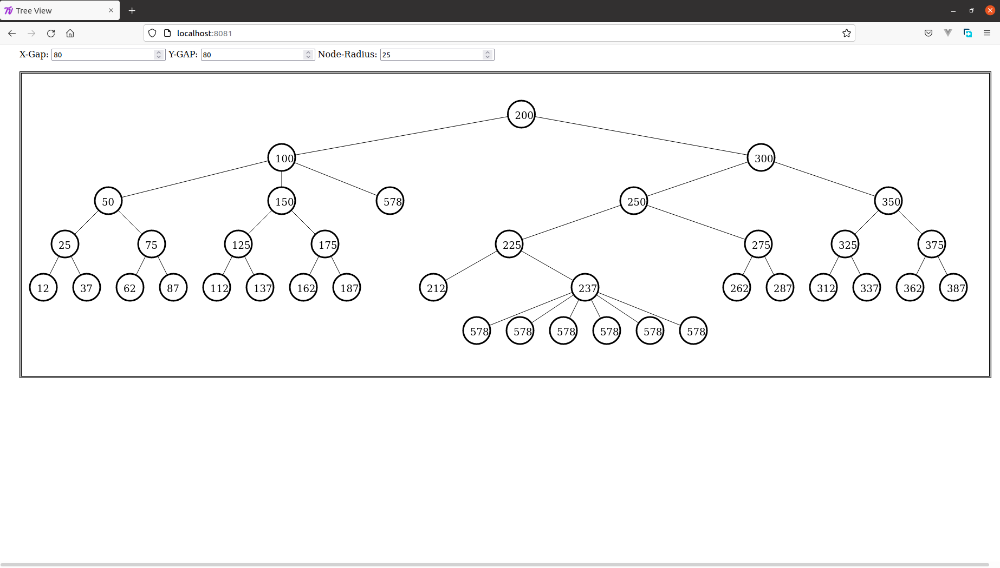

# treeview

It draws tree based on data provided in sampletree.json file which has following structure

```
{
    "data": Integer
    , "children": [
        {
            "data": Integer
            , "children": [
                . . .
            ]
        }
        ,
        . . .
    ]
}
```

it starts with parent node having children array which can include nodes exactly like parent i.e. having two properties "data" and "children"

just replace sampletree.json file with your data according to said structure and deploy (using http server, e.g. `python3 -m http.server 8081`) and visit deployed homepage and it will draw tree according to data in sampletree.json


